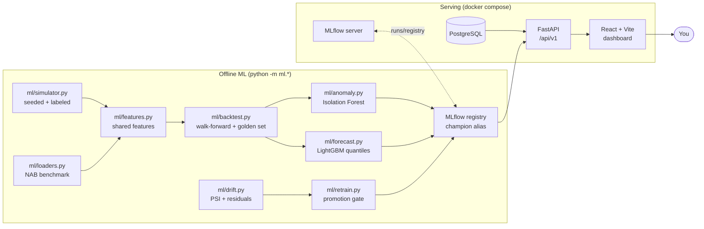

# PulseGuard

Real-time metric **anomaly detection & probabilistic forecasting** — a production-oriented
ML platform that ingests service metrics, detects anomalies (Isolation Forest), forecasts
expected ranges with uncertainty bands (LightGBM quantile regression), tracks and versions
models (MLflow), monitors data drift (PSI + residuals), and runs **controlled**
champion/challenger retraining where promotion is earned by measured results on a frozen
golden set — never automatic.

> Every number in this README and in `docs/` is measured by code in this repository with
> the reproducing command recorded next to it. Nothing is invented.

---

## Architecture



The full demonstrated lifecycle:

```
data → preprocessing → feature engineering → training → walk-forward validation
     → evaluation → registration → serving → drift monitoring → controlled retraining
     → promotion / rejection (audited)
```

**Complements CodeGraphV2** (code/graph/LLM analysis): PulseGuard is strictly classical
ML over numeric time-series — no LLMs, no RAG, no semantic search.

## Quickstart

Prerequisites: Docker Desktop, then everything else runs in containers.

```bash
# 1. bring up the platform (Postgres, MLflow, FastAPI, dashboard)
docker compose up -d --build

# 2. seed the demo (idempotent; first run trains + registers champions, ~2-3 min)
docker compose run --rm api python scripts/seed_demo.py

# 3. open the dashboard
#    http://127.0.0.1:5174   (charts, forecast bands, anomalies)
#    http://127.0.0.1:5000   (MLflow: runs, registry, champion aliases)
#    http://127.0.0.1:8000/docs   (OpenAPI)
```

Reset everything (wipes volumes): `docker compose down -v`.

### Demo workflow (drift → retrain → promotion)

The drift-and-recovery demonstration injects a seeded scenario end-to-end and writes an
auditable report (Git Bash on Windows; plain `docker compose run …` on Linux/macOS):

```bash
MSYS_NO_PATHCONV=1 docker compose run --rm \
  -v "$(pwd -W)/scripts:/code/scripts" -v "$(pwd -W)/ml/configs:/code/ml/configs" \
  -v "$(pwd -W)/ml/reports:/code/ml/reports" api \
  python scripts/drift_demo.py --config ml/configs/drift_demo.yaml \
  --api-url http://api:8000 --report ml/reports/drift_demo_report_run1.json
```

Measured outcome (see `docs/EVALUATION_REPORT.md`): PSI drift fires on all series, the
forecast challenger is **promoted** (+71.05% mean pinball on the frozen golden set), the
pre-drift challenger is **rejected**, and residuals recover to `ok` against the new
champion. Two runs produce identical reports modulo versions/timestamps.

### Offline evaluation (no Docker needed for the ML core)

```bash
pip install -e ".[dev]"
python -m ml.train --task forecast --config ml/configs/train_synthetic.yaml   # walk-forward metrics
python -m ml.train --task anomaly  --config ml/configs/train_synthetic.yaml
```

Reports land in `ml/reports/` (config SHA-256 + seed + per-fold metrics). Reproduction
numbers and methodology: `docs/EVALUATION_REPORT.md`; serving/benchmark numbers:
`docs/BENCHMARKS.md`.

## Repository map

```
backend/   FastAPI app: ingestion, query, inference, registry, drift, alerts APIs;
           Alembic migrations 0001-0004; tests
ml/        offline ML: simulator, NAB loader, features, backtest, anomaly (IF),
           forecast (LightGBM quantiles), evaluation, drift (PSI), retraining,
           tracking; configs + tests
frontend/  React 18 + TypeScript + Vite + Recharts dashboard; 5 pages over live API
scripts/   seed_demo.py, drift_demo.py, bench_*.py
docs/      IMPLEMENTATION_PLAN.md (6-phase execution log), EVALUATION_REPORT.md,
           BENCHMARKS.md
```

## Measured highlights

| claim | number | source |
|---|---|---|
| walk-forward forecast (latency h=1) | mean pinball 0.970, MAE 3.69 ms, −57.9% vs naive | `docs/EVALUATION_REPORT.md` |
| drift-and-recovery cycle | forecast challenger promoted, +71.05% golden pinball | `docs/EVALUATION_REPORT.md` |
| warm forecast serving | p50 54 ms end-to-end (history → features → predict → persist) | `docs/BENCHMARKS.md` |
| bulk ingestion | 2,854 points/s (idempotent upsert) | `docs/BENCHMARKS.md` |
| anomaly detection (NAB sanity) | PR-AUC 0.430 (IF) vs 0.204 (z-score baseline) | `docs/EVALUATION_REPORT.md` |

## What this project is NOT

- No LLMs, RAG, chatbots, or semantic search (that is CodeGraphV2's territory).
- No streaming bus, scheduler daemon, or Kubernetes — a single-node Docker Compose
  deployment, deliberately.
- No continuous "self-learning": retraining is explicitly triggered (CLI / API
  trigger / demo script) and every promotion is earned through the measured gate.
- No fake numbers: reports carry config SHA-256 + seed + per-fold metrics, and each
  claim links to the command that produced it.

## Limitations

Single-node local deployment (no horizontal scaling or multi-user concurrency was
measured); synthetic data dominates the evaluation (one NAB series as a sanity check);
no authentication (local demo tool); the anomaly challenger's golden PR-AUC did not
improve in the Phase 4 demo and was honestly rejected (few labeled golden anomalies —
see the evaluation report's threats to validity).

## Documentation

- `PULSEGUARD.md` — project source of truth (what/why/rules)
- `docs/IMPLEMENTATION_PLAN.md` — the six-phase execution log with completion criteria
  and per-phase measured results
- `docs/EVALUATION_REPORT.md` — ML methodology + measured evaluation tables
- `docs/BENCHMARKS.md` — serving/ingestion/query benchmarks + methodology
